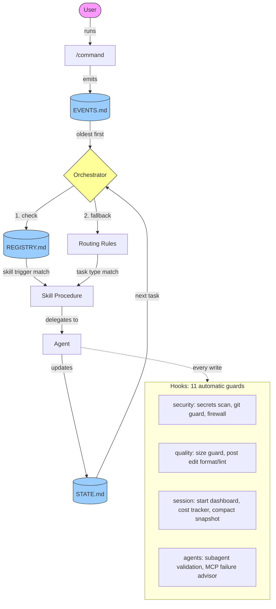

# The AI Orchestrator System

I always wanted to build apps, but I never had the passion to write code. I've worked with amazing and talented people over the years who could, and I have admired them and still do. My expertise came in the form of providing structure to projects and keeping things moving. I could architect, think through systems, and direct. But actually shipping? That's where I kept getting stuck.

When Claude Code came along, I knew I had to get started. I quickly realized that setting up a framework was the most important step. Without structure, the AI does great work for a few turns and then loses context, contradicts itself, or goes in circles. With structure, it becomes a reliable development team.

There's a book by Uri Levine called "Fall in Love with the Problem, Not the Solution." The problem I fell in love with is simple: how do you ship software when writing code isn't your strength? I built scriptureguide.org because I wanted to connect how I feel in the moment with scripture. I built an educational game because my daughter needed a fun way to learn. The framework came from needing a reliable way to ship all of it.

## What It Does

The AI Orchestrator System turns Claude Code into a structured software development team. You describe what you want to build. The system figures out what to do next.

Instead of a blank AI chat, you get 12 specialized agents, 36 skill procedures, 11 safety hooks, and a dispatch chain that routes every task to the right agent with the right process. Independent tasks can run in parallel across isolated git worktrees, then merge back automatically. You stay in control. Every action is reviewed before the next one starts.

## Install

```
npx create-ai-orchestrator
```

Run this in any project directory. It copies the full framework (12 agents, 36 skills, 20 commands, 11 hooks) into your project. Then open in VS Code with Claude Code and run `/start`.

```
npx create-ai-orchestrator my-new-app    # or create a new project
```

No dependencies. No build step. Just markdown and shell scripts.

## Who It's For

If you can think in systems but hit a wall when it's time to code, this was built for you. Run the install command above, open in VS Code with Claude Code, and start building by describing what you want in plain language.

## Token Efficient by Design

The framework loads ~700 tokens at startup (0.07% of the context window). Skills, agents, and knowledge files load only when needed. State persists across sessions so you never re-explain your project. Chat output stays concise while artifacts go to files. The result: fewer tokens per session and fewer sessions per project.

## The Naming Stack

| Layer | Name | What It Means |
|-------|------|---------------|
| **Problem** | The Syntax Wall | You can design systems, think architecturally, and manage projects but writing code line by line blocks you from shipping. |
| **Method** | AI Orchestration Framework | A structured method for coordinating AI agents, skills, and events so the AI builds while you direct. |
| **Tool** | The AI Orchestrator System | This template, the ready to use implementation of the framework for software development. |

## Prerequisites

You need three things before using this framework:

**1. A computer (Windows, Mac, or Linux)**

The framework works on all platforms. All commands and hooks are cross-platform compatible.

**2. Claude Code**

Claude Code is an AI coding assistant from Anthropic. You can use it in:

- **VS Code** (recommended): Install the Claude Code extension from the Extensions sidebar. Download VS Code from https://code.visualstudio.com if you don't have it.
- **JetBrains IDEs** (IntelliJ, WebStorm, PyCharm, etc.): Claude Code has a JetBrains plugin.
- **Terminal**: Install Claude Code as a CLI tool and run it directly. Works the same way, just less visual.

**3. A Claude subscription**

Claude Code requires an active Anthropic subscription (Pro or Max plan). You sign in through the Claude Code extension the first time you use it. It will walk you through the authentication.

That's everything. No programming languages to install, no build tools, no package managers. The framework is pure markdown and shell scripts.

## Quick Start

### Option A: One Command (Recommended)

```
npx create-ai-orchestrator my-app
cd my-app
```

Open `my-app` in VS Code with Claude Code, then:

```
/start             See where you are and what to do next
/setup             Set your project name, stack, and purpose
/capture-idea      Describe what you want to build
/run-project       Start processing (generates PRD, seeds tasks)
```

### Option B: Clone and Push

1. Clone this repository.
2. Open it in VS Code with Claude Code.
3. Tell Claude Code: `push my framework to C:\Users\me\Projects\my-cool-app`
4. Open the new project and run `/start`.

Either way, the system guides you from there.

## What's Inside

```
.claude/
  CLAUDE.md            Context index (loaded by Claude on startup)
  agents/              12 specialized AI agents (builder, reviewer, coach, etc.)
  commands/            20 entry point commands
  rules/               4 routing and governance policies
  skills/              28 built in task procedures + registry
custom-skills/           8 user created skills (security, marketing, growth)
  hooks/               11 automatic guards (security, quality, session mgmt)
  project/
    STATE.md           Current project status (single source of truth)
    EVENTS.md          Event queue (things to process)
    IDENTITY.md        Project identity lock (survives upgrades)
    knowledge/         Decisions, research, glossary, open questions
```

## Commands

20 commands, but you only need 3 to get started. The rest are there when you need them.

### Core: Every Session

| Command | What It Does | When to Use |
|---------|-------------|-------------|
| `/start` | Orients you: shows current phase, active task, and suggests the next action. | Beginning of every session. |
| `/run-project` | Executes the next unit of work: processes events, runs skills, advances tasks. | The main loop. Run it repeatedly to make progress. |
| `/save` | Persists all progress to files so the next session picks up where you left off. | End of every session, or before stepping away. |

### Periodic: When Needed

The system suggests these at the right time. You don't need to memorize them.

| Command | What It Does | When to Use |
|---------|-------------|-------------|
| `/setup` | Creates project structure, runtime files, and initial task queue. | Once, at project start. |
| `/capture-idea` | Walks you through describing what you want to build in plain language. | When you have a new project idea or feature concept. |
| `/status` | Dashboard view: phase, mode, progress percentage, active task, queue. | When you want a quick snapshot without starting work. |
| `/set-mode` | Switches execution speed (Safe / Semi-Auto / Autonomous) or planning depth (Full / Quick). | When you want more automation or want to slow down for review. |
| `/trigger` | Manually fires a workflow event (e.g., `DEPLOY_REQUESTED`, `BUG_REPORTED`). | When you need to kick off a specific workflow outside the normal flow. |
| `/doctor` | Runs 10+ diagnostics on your environment with optional auto repair. | After upgrades, when something feels broken, or before sharing the project. |
| `/clone-framework` | Copies or upgrades the framework into another project directory. | When starting a new project or upgrading an existing one to the latest version. |
| `/retro` | Engineering retrospective: analyzes commits, work patterns, and code quality metrics. | End of a sprint or week, or when you want to reflect on progress. |
| `/overnight` | Runs the project unattended with git verification, circuit breakers, auto learning, and a morning summary. | Before stepping away for hours when you have a full task queue and want progress without you. |

### Maintenance and Diagnostics: Rare

These keep the framework healthy. You may never need them directly.

| Command | What It Does | When to Use |
|---------|-------------|-------------|
| `/capture-lesson` | Saves a reusable insight to global memory for cross project learning. | When you discover something that would help future projects. |
| `/learn` | Analyzes the current session and extracts reusable lessons automatically. | End of a productive session. Let the system find its own lessons. |
| `/cleanup` | Reviews knowledge files for staleness and recommends cleanup. | When knowledge files feel bloated or outdated. |
| `/fix-registry` | Rebuilds the Skills Registry so the orchestrator can discover all workflows. | After adding/removing skills, or if `/doctor` flags registry issues. |
| `/test-framework` | Validates framework structure, dispatch chain, and file consistency. | After modifying framework files or before a release. |
| `/test-hooks` | Smoke tests all 11 hooks. Verifies they fire and block correctly. | After modifying hooks or upgrading the framework. |
| `/log-session` | Logs session quality metrics to the global progress tracker. | When you want to track productivity trends over time. |
| `/framework-review` | Deep review of framework health, unused components, and improvement opportunities. | Periodic framework maintenance (monthly or after major milestones). |

### Recommended First Time Flow

```
1. /start            See where you are and what to do next
2. /setup            Create project structure and runtime files
3. /capture-idea     Describe what you want to build
4. /run-project      Process the idea (generates PRD, seeds tasks)
5. /run-project      Execute the first task from the queue
```

## Framework Mode

Choose how much planning happens before building. Set during `/start` or change anytime with `/set-mode`.

| Mode | What Happens |
|------|-------------|
| **Quick Start** | Scaffold first, plan as you go. Describe your idea in 3 questions, get a working app immediately, add features one at a time. Planning docs grow with the code. |
| **Full Planning** *(Default)* | Plan before you build. Write a detailed PRD, design the architecture, break it into tasks, then build systematically. Best for complex projects. |

Switch with `/set-mode quick-start` or `/set-mode full-planning`. The system adapts: in Quick Start mode, if your project grows complex (10+ tasks, multiple integrations), the framework will suggest switching to Full Planning.

## Run Modes

Control how fast work happens within either framework mode.

| Mode | What Happens |
|------|-------------|
| **Safe** | Propose actions only. No files are modified. |
| **Semi-Autonomous** | Execute one safe cycle and pause for review. *(Default)* |
| **Autonomous** | Execute up to 10 cycles before stopping (configurable in RUN_POLICY.md). |

Switch modes with `/set-mode safe`, `/set-mode semi`, or `/set-mode auto`. Cycle limits and stop conditions are defined in .claude/project/RUN_POLICY.md. The current mode is shown in .claude/project/STATE.md.

## Mobile Development

Build native mobile apps with the same structured workflow. The framework supports three platforms out of the box:

| Platform | Stack | Best For |
|----------|-------|----------|
| **React Native + Expo** | Cross platform JavaScript | Ship to both stores with one codebase |
| **Swift/SwiftUI** | Native iOS (MVVM + @Observable) | iOS only apps needing platform specific polish |
| **Kotlin/Jetpack Compose** | Native Android (MVVM + StateFlow + Hilt) | Android only apps needing native performance |

The architecture designer agent prompts you to choose your platform, architecture pattern, and data layer. The builder follows modern best practices (and blocks deprecated APIs like ObservableObject, XML layouts, and LiveData). Testing, code review, QA, and app store deployment all have mobile specific procedures.

## Overnight Mode

For unattended runs, `/overnight` activates Autonomous mode with execution hardening:

- **Git verification** confirms tasks actually changed files (detects phantom completions)
- **Circuit breakers** stop after 3 consecutive failures or 4 hours (configurable)
- **Inter-cycle commits** one git commit per task for clean history and easy bisect/revert
- **Auto-compaction** compresses context every 8 cycles to prevent quality degradation
- **Planning review gate** auto critiques PRDs and architecture before building
- **Auto-learning** extracts lessons and saves to AI Memory when done
- **Morning summary** writes `docs/OVERNIGHT_SUMMARY.md` with full results

```
/overnight              defaults (50 cycles, 4 hours)
/overnight --cycles 20  limit cycles
/overnight --hours 2    limit time
/overnight --pr         create PR when done
```

## Parallel Execution

When the task queue has 2+ independent tasks at the same priority, the orchestrator dispatches them simultaneously in separate git worktrees. Each agent works in isolation, then results merge back one at a time.

- **Auto-detection** identifies independent tasks by skill type (frontend vs backend vs docs)
- **Up to 3 parallel agents** per cycle (configurable in RUN_POLICY.md)
- **Sequential merge** eliminates race conditions. The orchestrator is the single writer.
- **Conflict resolution** re-queues conflicted tasks automatically
- **Circuit breaker** stops if 2+ merge conflicts occur (tasks weren't truly independent)

Parallel execution is automatic. If only one task is eligible, the system falls back to sequential mode with no changes.

## Global Memory

The AI Orchestrator System supports cross project learning. All reusable knowledge (decisions, patterns, failures, and lessons) is stored in a separate **AI Memory** directory that lives outside any single project.

> **Setup:** Create an `AI-Memory` folder on your machine (e.g., alongside your projects) and set the `AI_MEMORY_PATH` environment variable to point to it. See the `/capture-lesson` command for details.

This allows future projects to benefit from past discoveries. The orchestrator checks global memory before major architectural work and writes new insights back when they emerge.

## Self-Improving Skills

The AI Orchestrator System can capture proposed improvements to reusable skills. When the orchestrator notices a skill causing repeated friction or rework, it logs a proposal in `SKILL_IMPROVEMENTS.md` inside your AI Memory folder.

Skills do not rewrite themselves automatically. Instead, the system logs proposed improvements for later review and approval. This keeps the improvement loop safe and human controlled.

## Architecture

How commands, events, skills, and agents connect:



**Dispatch chain:** Events > Skills (via REGISTRY) > Agents (via routing rules) > State updates

## Learn More

- **[User Guide](docs/USER_GUIDE.md)** Step by step walkthrough for first time users.
- **[Custom Skills Guide](docs/CUSTOM_SKILLS_GUIDE.md)** How to create your own skills.
- **[Framework Scope](docs/FRAMEWORK_SCOPE.md)** The conceptual "why" behind the framework.
- **[CLAUDE.md](.claude/CLAUDE.md)** Architecture index and context loading rules (loaded by Claude Code automatically).
