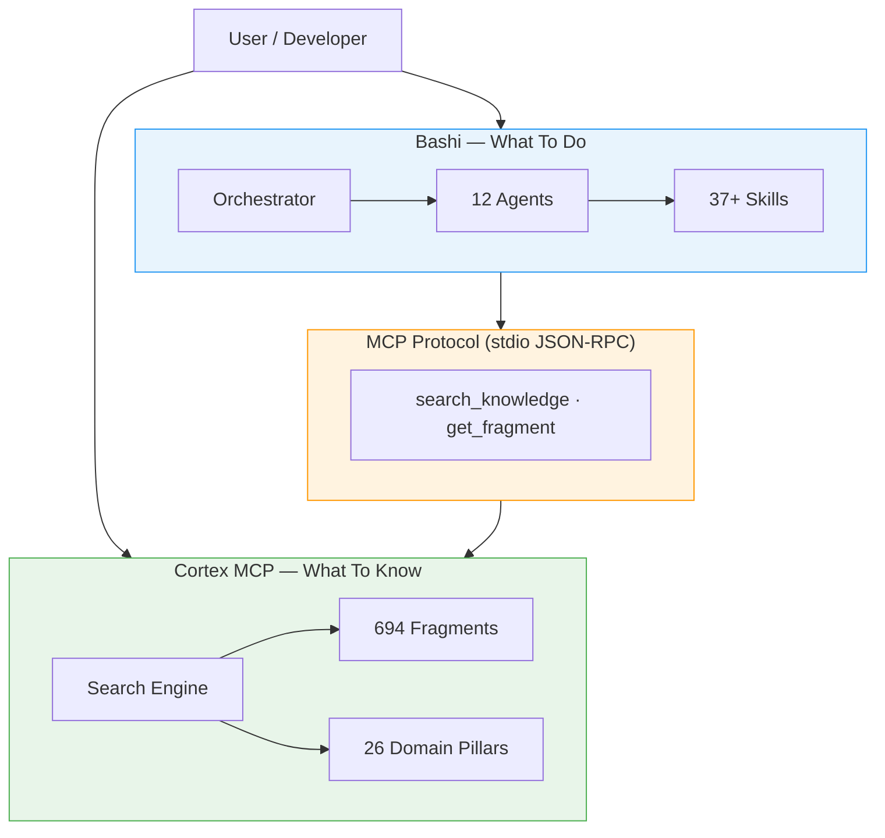
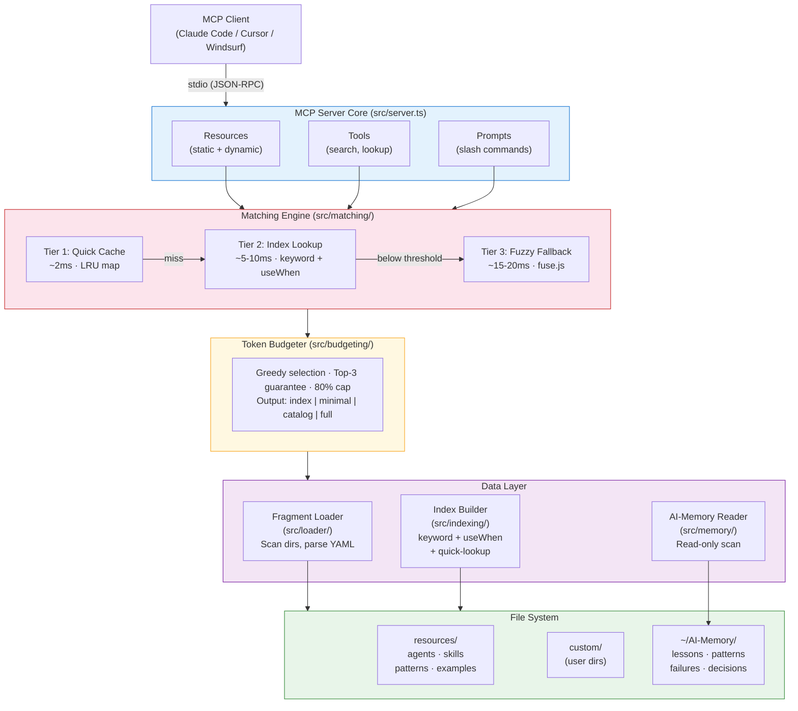
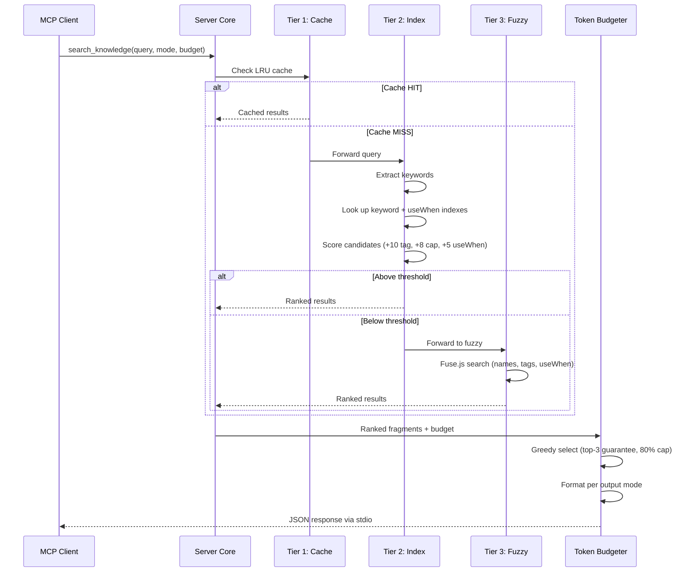
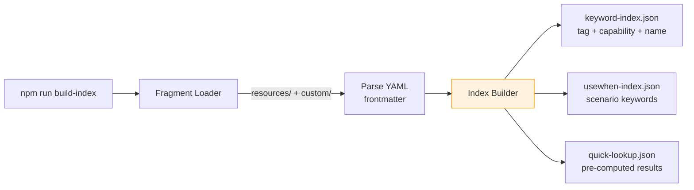
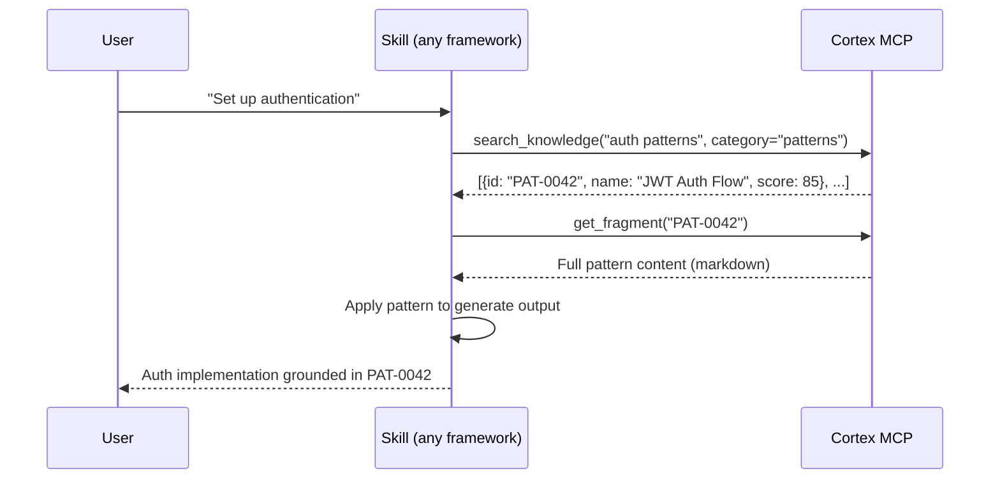

# Architecture — Cortex MCP

## Overview

Cortex MCP is a local-only MCP server that ships with a built-in library of structured markdown fragments (agents, skills, patterns, examples) and serves them on-demand to any MCP-compatible AI tool. It uses a three-tier matching pipeline (quick cache, pre-built index, fuzzy fallback) to find relevant fragments, applies token budgeting to stay within context limits, and returns results in one of four output modes.

**Architecture pattern:** Single-process CLI server with a pipeline architecture. All components run in one Node.js process, communicating through in-memory function calls. No microservices, no message queues, no network hops.

**Why this pattern:** The server handles one client connection at a time over stdio. There is no concurrency requirement, no multi-tenant scaling concern, and no reason to distribute components. A single process is the simplest thing that works and the easiest to install, debug, and ship.

---

## Tech Stack

| Layer | Choice | Rationale |
|-------|--------|-----------|
| Language | TypeScript 5.x | Type safety for the matching/scoring pipeline. Comfortable for the developer. |
| Runtime | Node.js 20+ LTS | Required by MCP SDK. LTS for stability. |
| MCP SDK | `@modelcontextprotocol/sdk` | Official SDK — protocol compliance, maintained by Anthropic. |
| Transport | stdio | MCP standard for local servers. No HTTP, no ports, no CORS. |
| YAML parsing | `yaml` (npm) | Parse YAML frontmatter from fragment files. Small, fast, no native deps. |
| Fuzzy matching | `fuse.js` | Proven fuzzy search library. Lightweight, configurable scoring. |
| File watching | `chokidar` | Cross-platform file watcher for dev-mode hot reload. |
| Build tool | `tsup` or `tsc` | Bundle TypeScript to distributable JS. tsup preferred for speed; tsc as fallback. |
| Test framework | `vitest` | Fast, TypeScript-native, no config overhead. |
| Package manager | npm | Ships with Node.js. No extra install step for users. |

**Dependencies at runtime:** `@modelcontextprotocol/sdk`, `yaml`, `fuse.js`. That's it. Everything else is a dev dependency.

**No runtime cost:** Zero cloud, zero network, zero API keys, zero inference. All matching is pure algorithmic.

---

## Two-Layer System Overview

Cortex MCP is the **knowledge layer** ("what to know") in a two-layer architecture. It pairs with [Bashi](https://github.com/BasharAmso/bashi), the **orchestration layer** ("what to do"). Any MCP-compatible tool can use either or both layers.



## Component Diagram



---

## Directory Structure

```
cortex-mcp/
├── src/
│   ├── index.ts              # Entry point — starts MCP server
│   ├── server.ts             # MCP server setup (resources, tools, prompts)
│   ├── config.ts             # Configuration loading and defaults
│   ├── loader/
│   │   ├── fragment-loader.ts    # Scan directories, parse frontmatter
│   │   └── types.ts              # Fragment type definitions
│   ├── indexing/
│   │   ├── index-builder.ts      # Build keyword, useWhen, quick-lookup indexes
│   │   └── types.ts              # Index type definitions
│   ├── matching/
│   │   ├── quick-cache.ts        # Tier 1: LRU cache for repeated queries
│   │   ├── index-lookup.ts       # Tier 2: Pre-built index search
│   │   ├── fuzzy-search.ts       # Tier 3: Fuse.js fuzzy fallback
│   │   ├── scorer.ts             # Multi-signal scoring (tags, capabilities, useWhen)
│   │   └── engine.ts             # Orchestrates three tiers
│   ├── budgeting/
│   │   ├── token-budgeter.ts     # Greedy selection with top-3 guarantee
│   │   └── output-modes.ts       # index, minimal, catalog, full formatters
│   ├── memory/
│   │   └── memory-reader.ts      # AI-Memory read-only scanner
│   ├── cache/
│   │   └── lru-cache.ts          # LRU cache with configurable TTL
│   └── reload/
│       └── watcher.ts            # Chokidar file watcher for dev mode
├── resources/                # Built-in knowledge library
│   ├── agents/               # Agent definition fragments
│   ├── skills/               # Skill procedure fragments
│   ├── patterns/             # Reusable pattern fragments
│   └── examples/             # Code example fragments
├── scripts/
│   └── build-index.ts        # CLI: npm run build-index
├── tests/
│   ├── loader.test.ts
│   ├── matching.test.ts
│   ├── budgeting.test.ts
│   └── memory.test.ts
├── package.json
├── tsconfig.json
└── README.md
```

---

## Data Model

### Fragment (core entity)

A fragment is a single markdown file with YAML frontmatter. It is the atomic unit of knowledge.

```yaml
---
id: SKL-0001
name: Plan From Idea
category: skills          # agents | skills | patterns | examples
tags: [planning, idea, capture]
capabilities: [idea-intake, task-seeding]
useWhen:
  - user captures a new project idea
  - starting a project from scratch
estimatedTokens: 850
relatedFragments: [SKL-0004, AGT-0001]
dependencies: []
---

# Plan From Idea

[markdown content...]
```

**Key fields:**
| Field | Type | Purpose |
|-------|------|---------|
| `id` | string | Unique identifier (e.g., SKL-0001, AGT-0003) |
| `name` | string | Human-readable name |
| `category` | enum | agents, skills, patterns, examples |
| `tags` | string[] | Keywords for matching |
| `capabilities` | string[] | What this fragment enables |
| `useWhen` | string[] | Natural-language scenarios for matching |
| `estimatedTokens` | number | Approximate token cost of full content |
| `relatedFragments` | string[] | Cross-references to related fragments |
| `dependencies` | string[] | Fragments that must be loaded first |

### Pre-Built Indexes

Built by `npm run build-index` and saved as JSON files. Loaded into memory at server start.

| Index File | Structure | Purpose |
|------------|-----------|---------|
| `keyword-index.json` | `{ keyword: [fragmentId, ...] }` | Inverted index mapping keywords to fragments |
| `usewhen-index.json` | `{ keyword: [{ fragmentId, scenario }] }` | Inverted index mapping keywords to useWhen scenarios |
| `quick-lookup.json` | `{ query: [fragmentId, ...] }` | Pre-computed results for common queries |

### AI-Memory Entry

Read-only scan of the user's AI-Memory directory. Entries are not indexed — they are scanned on-demand with keyword matching.

```
~/AI-Memory/
├── lessons/       # What worked, what didn't
├── patterns/      # Reusable approaches
├── failures/      # What failed and why
├── decisions/     # Past architectural decisions
└── GLOBAL_INDEX.md
```

---

## Data Flow

### Query Flow (runtime)



**Scoring weights:**
| Signal | Weight |
|--------|--------|
| Tag match | +10 per tag |
| Capability match | +8 per capability |
| Synonym match | +8 per synonym |
| useWhen match | +5 per scenario |
| Category filter bonus | +15 if matches |
| Small resource bonus | +5 if < 500 tokens |

### Index Build Flow (offline)



### Skill Calling Cortex (integration pattern)

This sequence shows how any skill (in Bashi, Cursor, Copilot, or custom agents) uses Cortex mid-execution to ground its output in validated patterns:



---

## MCP Surface

### Resources (static URIs)

| URI Pattern | Returns |
|-------------|---------|
| `cortex://library/index` | Full index of all fragments (id, name, category, estimatedTokens) |
| `cortex://library/{category}` | All fragments in a category (agents, skills, patterns, examples) |
| `cortex://fragment/{id}` | Full content of a specific fragment by ID |

### Resources (dynamic templates)

| URI Template | Parameters | Returns |
|--------------|------------|---------|
| `cortex://search/{query}` | query string | Matched fragments (default output mode) |
| `cortex://search/{query}?mode={mode}` | query, output mode | Matched fragments in specified mode |
| `cortex://search/{query}?budget={tokens}` | query, token budget | Budget-constrained results |

### Tools

| Tool Name | Parameters | Purpose |
|-----------|------------|---------|
| `search_knowledge` | query, mode?, budget?, category?, pillar? | Primary search tool — runs the three-tier pipeline |
| `get_fragment` | id | Retrieve a specific fragment by ID |
| `browse_library` | category?, pillar? | Browse all fragments or filter by category/pillar |
| `list_categories` | — | List categories and pillars with fragment counts |
| `detect_project` | files[] | Detect tech stack from project filenames and suggest searches |

### Prompts (slash commands)

| Prompt Name | Arguments | Purpose |
|-------------|-----------|---------|
| `find` | query | Quick search shorthand |
| `explain` | topic | Find and return the most relevant fragment for a concept |
| `related` | fragmentId | Show related fragments and dependencies |

---

## Configuration

Configuration is loaded from `cortex.config.json` in the project root (or passed via CLI flags).

```json
{
  "directories": [
    "./resources"
  ],
  "customDirectories": [],
  "aiMemoryPath": "~/Projects/AI-Memory",
  "cache": {
    "maxSize": 100,
    "ttl": 14400000
  },
  "matching": {
    "fuzzyThreshold": 0.3,
    "maxResults": 10,
    "defaultMode": "minimal",
    "defaultBudget": 4000
  },
  "devMode": false,
  "indexPath": ".cortex"
}
```

| Field | Default | Purpose |
|-------|---------|---------|
| `directories` | `["./resources"]` | Built-in fragment directories |
| `customDirectories` | `[]` | Additional user directories to scan |
| `aiMemoryPath` | `~/Projects/AI-Memory` | AI-Memory location (or `$AI_MEMORY_PATH`) |
| `cache.maxSize` | 100 | LRU cache entries |
| `cache.ttl` | 14400000 (4h) | Cache TTL in milliseconds |
| `matching.fuzzyThreshold` | 0.3 | Fuse.js match threshold (0 = exact, 1 = anything) |
| `matching.maxResults` | 10 | Max fragments returned per query |
| `matching.defaultMode` | `"minimal"` | Default output mode |
| `matching.defaultBudget` | 4000 | Default token budget |
| `devMode` | false | Enable hot reload file watcher |
| `indexPath` | `".cortex"` | Where pre-built indexes are stored |

---

## Cross-Cutting Concerns

### Caching Strategy

- **Quick Cache (Tier 1):** In-memory LRU map. Key = normalized query string. Value = scored fragment IDs. TTL = 15 minutes for quick-lookup queries, 4 hours for computed results. Max 100 entries.
- **Fragment Cache:** Parsed fragment objects held in memory after first load. Invalidated on hot reload or server restart.
- **Index Cache:** Pre-built indexes loaded into memory at startup. Rebuilt only via `npm run build-index`.

### Error Handling

- **Missing frontmatter:** Skip file with a warning log. Never crash.
- **Malformed YAML:** Skip file with a warning log. Report in `list_categories` response.
- **Missing AI-Memory directory:** Disable AI-Memory features silently. Log once.
- **Missing indexes:** Fall back to fuzzy-only matching with a performance warning.
- **Invalid config:** Use defaults with a warning. Never crash on bad config.

### Logging

- Structured JSON logs to stderr (stdout is reserved for MCP stdio transport).
- Log levels: `error`, `warn`, `info`, `debug`.
- Default level: `info` (configurable via `LOG_LEVEL` env var).
- Performance timing logged at `debug` level for each query tier.

### Security

- **Read-only:** Server never writes to the filesystem (except index building, which is a separate CLI command).
- **No network:** Zero outbound connections. No telemetry, no analytics, no update checks.
- **No secrets:** No API keys, no credentials, no auth tokens. Nothing to leak.
- **No code execution:** Fragments are markdown. They are read and returned, never executed.
- **Path traversal prevention:** Fragment loader rejects paths that escape configured directories.

---

## Architecture Decision Records

### ADR-001: Single-Process Pipeline Over Microservices

- **Status:** Accepted
- **Context:** Need to decide on process architecture for the MCP server.
- **Decision:** Single Node.js process with in-memory component communication. No separate services, no message queues.
- **Consequences:** Simplest possible deployment (one binary). No inter-process overhead. Cannot scale horizontally, but horizontal scaling is irrelevant for a local-only server serving one client at a time.

### ADR-002: stdio Transport Only (No HTTP)

- **Status:** Accepted
- **Context:** MCP supports both stdio and HTTP transports. Need to pick one for v1.
- **Decision:** stdio only. No HTTP server, no ports, no CORS.
- **Consequences:** Matches how MCP clients (Claude Code, Cursor, Windsurf) connect to local servers. Simpler setup — no port conflicts, no firewall issues. Logging must go to stderr since stdout is the transport channel.

### ADR-003: Pre-Built Indexes Over Runtime Indexing

- **Status:** Accepted
- **Context:** The matching engine needs fast lookups. Options: build indexes at query time, or pre-build them offline.
- **Decision:** Pre-built indexes via `npm run build-index`. Indexes are JSON files loaded into memory at startup.
- **Consequences:** Near-zero query overhead for Tier 2 lookups. Requires a build step when fragments change. Hot reload in dev mode re-triggers index building. Trade-off is acceptable — fragments change rarely compared to query frequency.

### ADR-004: Fuse.js for Fuzzy Matching

- **Status:** Accepted
- **Context:** Tier 3 fallback needs fuzzy text search. Options: custom implementation, fuse.js, flexsearch, minisearch.
- **Decision:** Fuse.js. Lightweight (7KB gzipped), well-maintained, configurable scoring, no native dependencies.
- **Consequences:** Adds one runtime dependency. Fuzzy quality is good enough for natural-language queries against fragment metadata. If performance becomes an issue at 1000+ fragments, consider minisearch as a replacement.

### ADR-005: Four Output Modes for Progressive Loading

- **Status:** Accepted
- **Context:** Different use cases need different detail levels. Loading full content for every result wastes tokens.
- **Decision:** Four output modes — `index` (IDs and names only), `minimal` (JSON metadata + URIs), `catalog` (full metadata without content), `full` (complete markdown content).
- **Consequences:** Clients can progressively load detail. Default mode (`minimal`) balances information with token cost. Full mode available for when the client needs the actual content.

### ADR-006: AI-Memory Integration as Read-Only On-Demand Scan

- **Status:** Accepted
- **Context:** AI-Memory integration is a v1 differentiator. Options: index AI-Memory alongside library fragments, or scan on-demand.
- **Decision:** On-demand keyword scan. AI-Memory entries are not pre-indexed.
- **Consequences:** No build step required for AI-Memory. Slightly slower than indexed lookup, but AI-Memory is typically small (<100 entries). Results appear as a separate "Related from your experience" section, clearly distinguished from library results. Avoids complexity of indexing external directories that change independently.

### ADR-007: TypeScript with tsup for Build

- **Status:** Accepted
- **Context:** Need a build pipeline to compile TypeScript to distributable JavaScript.
- **Decision:** tsup as primary bundler (fast, zero-config for libraries). Fallback to plain tsc if tsup introduces issues.
- **Consequences:** Fast builds during development. Single entry point output for clean npm distribution. tsup handles CJS/ESM dual output if needed later.

---

## Open Questions (Architecture-Level)

See [OPEN_QUESTIONS.md](../.claude/project/knowledge/OPEN_QUESTIONS.md) for the full list. Architecture-relevant items:

- **OQ-0003:** Markdown without frontmatter — skip or best-effort? (Affects fragment loader design)
- **OQ-0004:** AI-Memory scoring weight relative to library fragments (Affects scorer.ts)
- **OQ-0005:** MCP prompts in v1? (Affects server.ts surface area)
