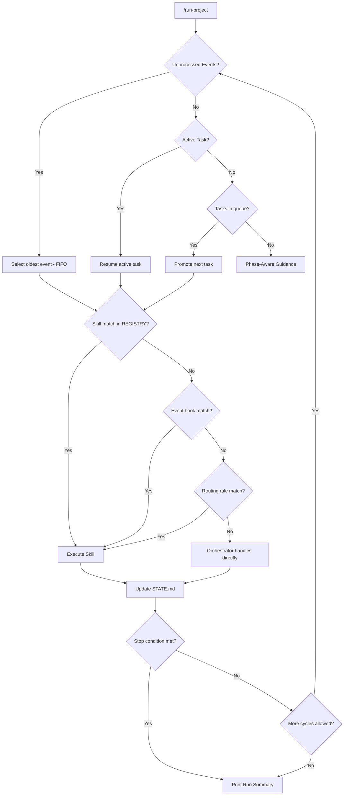
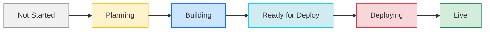
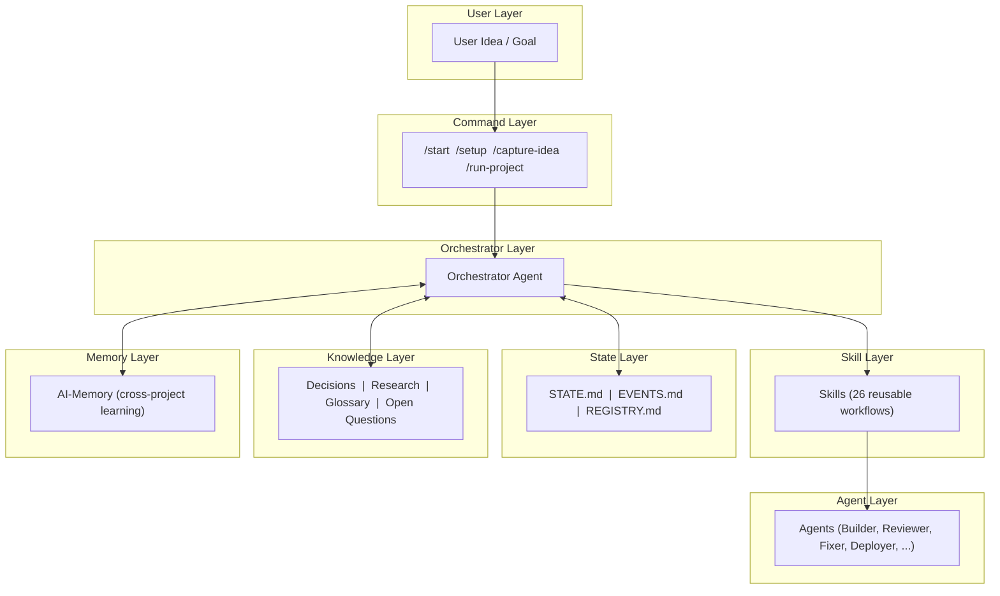
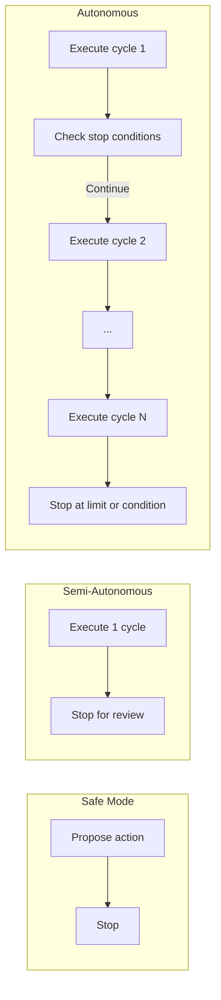

# Diagrams

> Visual representations of The AI Orchestrator System architecture. Rendered using Mermaid syntax.

---

## The Dispatch Chain

How the system routes work from events to execution:

---

## Project Lifecycle

The phases a project moves through:

---

## The Orchestration Stack

How the framework layers are organized:

---

## Run Modes

How the three execution modes compare:

